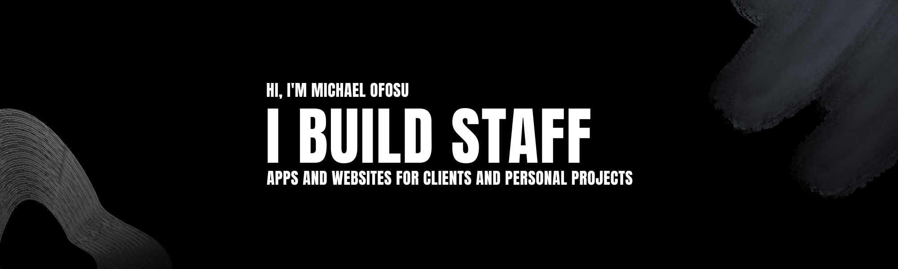

  

###

# Hello World!, I'm Michael 👋🏼:

### Serial Founder | Quantitative Trader | Fitness Coach

I wear a few different hats—I'm a developer, an algorithmic trader, and a gym coach. When I'm not busy studying for my Information Systems degree, I'm running **[Ace TechTrove](https://acetechtrove.vercel.app)**, an independent product studio where we focus on building apps that people actually love to use. 

## What I'm up to

- **Building at Ace TechTrove:** I'm the Founder & CEO, steering the ship for products like BrickBlast, Wordy, and FormLark.
- **Algorithmic Trading:** I spend a good chunk of my time backtesting custom market indicators with Pine Script and diving deep into quantitative analysis.
- **Coaching in the Gym:** I love helping people get stronger. Whether I'm writing code or coaching clients, it's all about building a solid foundation and getting real results.
- **Fueling the Grind:** I'm a big believer in a good morning routine. You can usually catch me testing out new healthy breakfast recipes, blending smoothies, or knocking back a turmeric and lemon shot to start the day :) 

# Tech Stack:
                               
